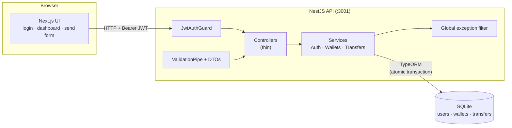
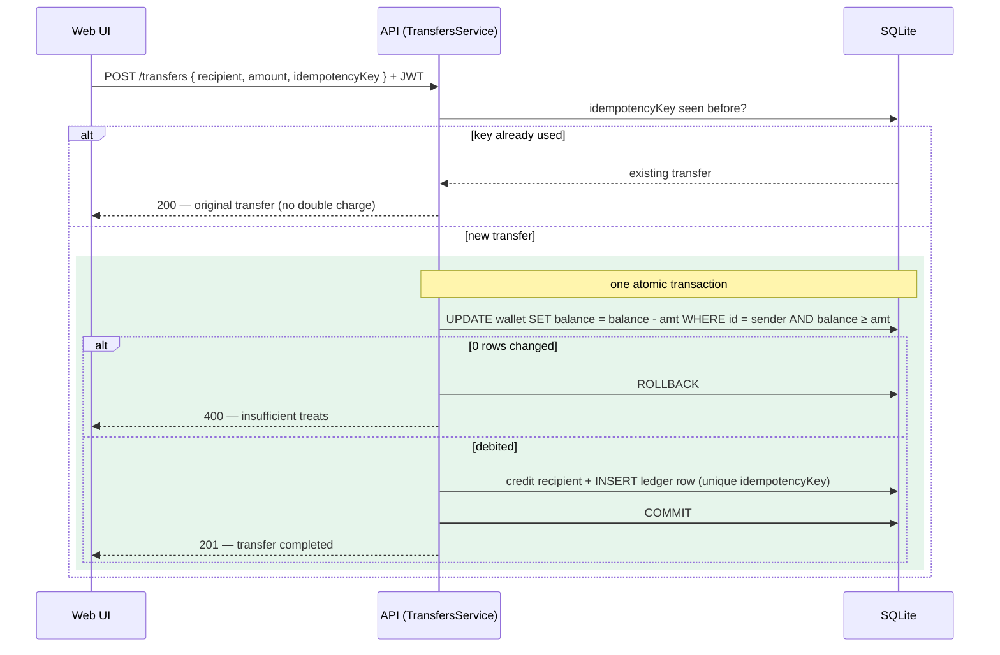

# MeowPay 🐾

A fictional digital wallet for cats. The currency is **treats**. This repo is a take-home exercise: one thin vertical slice — *a cat sends treats to another cat* — wired end-to-end from a real Next.js UI, through a real NestJS backend, to a real persisted SQLite database.

---

## Stack

| Layer | Technology |
| --- | --- |
| Backend | NestJS 10, TypeORM 0.3, better-sqlite3 |
| Frontend | Next.js 14 (App Router), React 18, TypeScript |
| Auth | JWT (register / login), bcryptjs password hashing, passport-jwt guard |

**Repo layout**

```
/            root package.json — runs both apps together
├── api/     NestJS backend (default port 3001)
└── web/     Next.js frontend (default port 3000)
```

---

## Quick start (from a fresh clone)

### 1. Prerequisites

- **Node.js 18+** (Node 22 recommended)
- npm (ships with Node)

### 2. Install dependencies

From the repo root, install everything in one command:

```bash
npm run install:all
```

> This installs the root runner (`concurrently`) and then both apps (`api/`
> and `web/`), so `npm run dev` works immediately afterwards.

Or install each app separately:

```bash
npm install              # root, for concurrently
cd api && npm install
cd ../web && npm install
```

### 3. Environment setup

Copy the example env files. **The defaults already work for local development** — you don't need to change anything to get running.

```bash
cp api/.env.example        api/.env
cp web/.env.local.example  web/.env.local
```

**`api/.env`**

| Variable | Purpose |
| --- | --- |
| `PORT` | API port (default `3001`) |
| `DATABASE_PATH` | Path to the SQLite database file |
| `JWT_SECRET` | Secret used to sign JWTs |
| `JWT_EXPIRES_IN` | Token lifetime |
| `STARTING_BALANCE` | Treats granted to a new account on registration (default `100`) |
| `CORS_ORIGIN` | Allowed frontend origin (default `http://localhost:3000`) |

**`web/.env.local`**

| Variable | Purpose |
| --- | --- |
| `NEXT_PUBLIC_API_URL` | Base URL of the API (default `http://localhost:3001`) |

### 4. Seed the database

Create a few demo cats to log in as:

```bash
npm run seed        # from the repo root
# or: cd api && npm run seed
```

This is **idempotent** — running it more than once won't create duplicates.

| Cat | Password | Starting balance |
| --- | --- | --- |
| `whiskers` | `password123` | 500 treats |
| `mittens` | `password123` | 300 treats |
| `tom` | `password123` | 100 treats |

### 5. Run both apps

From the repo root, start the API and the web app together with labeled output:

```bash
npm run dev
```

Output is prefixed `[api]` and `[web]` so you can tell the two logs apart.

Or run each app separately in its own terminal:

```bash
cd api && npm run start:dev   # http://localhost:3001
cd web && npm run dev         # http://localhost:3000
```

### 6. Send some treats

Open **http://localhost:3000**, log in as a seeded cat (e.g. `whiskers` / `password123`), and send treats to another cat (e.g. `mittens`). Watch the balance and history update.

---

## How it works

### Architecture



The transfer path is a single vertical slice: **UI → guard → validation → service → one atomic SQL transaction → persisted balances + ledger**, with nothing mocked.

### Layers

1. **Web (Next.js)** — App Router pages call the API over HTTP. The JWT returned at login is stored client-side and attached to authenticated requests.
2. **API (NestJS)** — Thin controllers delegate to services. DTOs are validated by `class-validator` behind a global `ValidationPipe`; a global exception filter produces a consistent JSON error shape. Interactive OpenAPI docs are served at **`/docs`**.
3. **Database (SQLite via TypeORM)** — Persists users, wallets, and an immutable transfer ledger.

### The transfer flow, step by step

When a cat sends treats (`POST /transfers`):

1. The request is authenticated (JWT guard) and validated (DTO + `ValidationPipe`).
2. The recipient cat is looked up by name; unknown recipient or self-transfer is rejected.
3. A **single atomic database transaction** performs three writes together:
   - **Debit** the sender's wallet.
   - **Credit** the recipient's wallet.
   - **Insert** an immutable row into the `transfers` ledger.
4. If any step fails (e.g. insufficient funds), the whole transaction **rolls back** — no partial state.
5. The persisted transfer is returned. History (`GET /transfers`) shows each transfer with its direction (`sent` / `received`).



### Data model

- **User** — a cat's identity: name and hashed password (bcryptjs).
- **Wallet** — belongs to a user; holds an integer `balance` of treats and a `version` column for optimistic concurrency.
- **Transfer** — an immutable ledger entry: sender, recipient, amount, `idempotencyKey` (UNIQUE), and timestamp.

---

## Correctness & money-movement guarantees

These are the fintech fundamentals of the slice.

### Money is stored as integer treats

Balances and amounts are **INTEGER treats — never floats**. Integer arithmetic is exact, so there is no rounding drift or floating-point error in balances.

### Atomicity

A transfer is **one atomic DB transaction**: debit sender + credit recipient + insert the ledger row, **all-or-nothing**. There is no window in which treats have left one wallet but not arrived in the other.

### Overdraft & concurrency safety

The debit is a **conditional UPDATE**:

```sql
UPDATE wallet SET balance = balance - :amt WHERE id = :id AND balance >= :amt
```

If **0 rows** are affected, the sender didn't have enough treats → **insufficient funds** → the transaction rolls back. Because the balance check and the decrement happen in a single atomic statement, two concurrent transfers can't both pass the check and drive the balance negative. This approach is **race-safe and portable**, and was chosen deliberately: TypeORM's SQLite driver has poor pessimistic-lock support. The wallet's **`version` column (optimistic concurrency)** stands as a documented second guard.

### Idempotency

Every transfer request carries an **`idempotencyKey`** (UNIQUE in the DB).

- Re-submitting the **same key** returns the **original transfer** instead of charging twice.
- Reusing a key for a **materially different transfer** returns a **409 Conflict**.

This makes client retries (dropped connections, double-clicks) safe.

---

## API reference

Interactive OpenAPI/Swagger docs run at **http://localhost:3001/docs** once the API is up — you can paste a JWT from `/auth/login` into the **Authorize** box and call the guarded endpoints straight from the browser. The raw spec is at `/docs-json`.

All amounts are integer treats. Authenticated endpoints require a `Bearer <JWT>` header.

| Method | Path | Auth | Body | Returns |
| --- | --- | --- | --- | --- |
| `POST` | `/auth/register` | — | credentials | New account (seeded with `STARTING_BALANCE` treats) |
| `POST` | `/auth/login` | — | credentials | JWT access token |
| `GET` | `/wallets/me` | JWT | — | The authenticated cat's wallet & balance |
| `POST` | `/transfers` | JWT | `{ recipientCatName, amount, idempotencyKey }` | The created (or original, if idempotent) transfer |
| `GET` | `/transfers` | JWT | — | Transfer history with direction (`sent` / `received`) |

> New accounts are granted `STARTING_BALANCE` treats (default 100) on registration. This is a documented **demo convenience** standing in for a real human "top-up" flow, which is out of scope for this slice.

---

## Testing

All tests live in `api/`.

```bash
npm test        # unit tests   (from root, or: cd api && npm test)
npm run test:e2e   # e2e tests  (from root, or: cd api && npm run test:e2e)
```

**Unit tests** exercise `TransfersService` money logic in isolation with mocked dependencies.

**E2E tests** run `supertest` against an in-memory SQLite database and cover the full flow and its edge cases:

- Full register → login → transfer happy path
- Insufficient funds
- Self-transfer rejection
- Unknown recipient
- Bad amounts (validation)
- Idempotency — no double charge on a repeated key
- Concurrency — no overdraft under simultaneous transfers

---

## Trade-offs & what I skipped (and why)

This is a ~half-day vertical slice, so scope was cut deliberately to keep the money-movement core honest and well-tested rather than broad.

- **Starting balance instead of a real top-up flow.** New cats get `STARTING_BALANCE` treats on registration so you can send treats immediately. A real deposit/top-up integration is out of scope.
- **JWT in client storage (localStorage) rather than an httpOnly cookie.** Simpler for a demo; a production build would prefer httpOnly cookies to mitigate XSS token theft.
- **`synchronize: true` instead of migrations.** TypeORM auto-syncs the schema for zero-setup local dev. Production would use versioned migrations.
- **Single-node SQLite.** Great for a portable, zero-dependency demo. The correctness design (atomic conditional debit) is not SQLite-specific and carries over to other SQL engines.
- **No rate limiting, refresh tokens, or pagination.** All reasonable next steps, none essential to demonstrating the core transfer slice.

---

## Built with AI

This project was built with an AI coding agent (Claude) driving the implementation. Every design decision here — integer-only money, the atomic conditional-debit for overdraft safety, idempotency keys, and the layered NestJS module structure — is understood and defensible by me as the author. The AI accelerated the typing; the architecture and the correctness guarantees are deliberate choices I stand behind.
